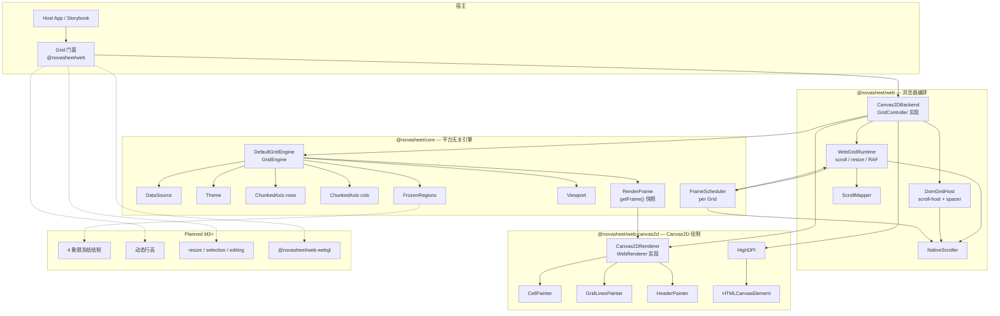
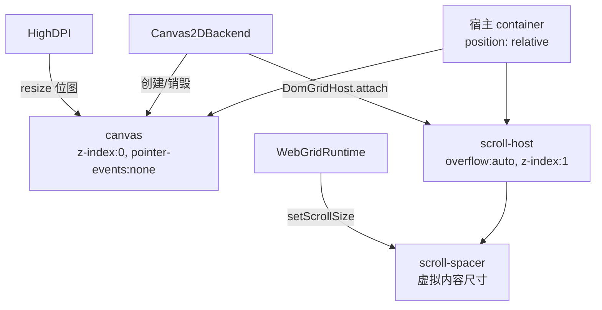
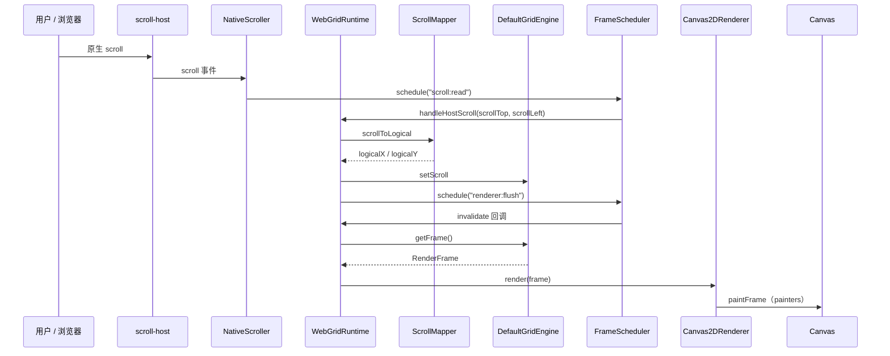
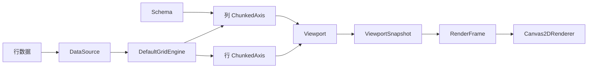
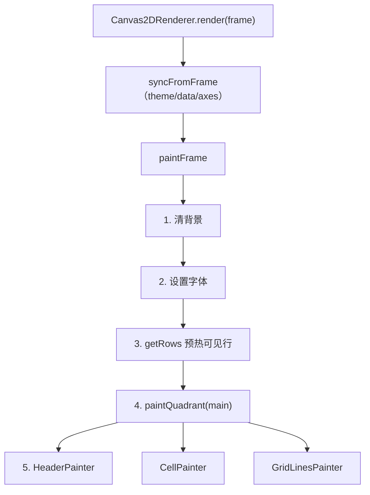

# NovaSheet 当前架构设计图

- **范围**：当前仓库源码状态（`refactor/cross-platform` 分支）
- **包**：`@novasheet/core` · `@novasheet/web` · `@novasheet/web-canvas2d`
- **对外入口**：`import { Grid } from '@novasheet/web'`（默认 `renderer: 'canvas2d'`）
- **能力状态**：M2 虚拟滚动 + 原生滚动映射已实现；M3 冻结象限 / 动态行高 / 交互 resize 仍为 planned

---

## 1. 包依赖与总体架构



**依赖方向（无环）**：`core` ← `web-canvas2d` ← `web` ← Storybook / 应用。

| 包                        | 职责                                                                                                                  | 不含                        |
| ------------------------- | --------------------------------------------------------------------------------------------------------------------- | --------------------------- |
| `@novasheet/core`         | 数据、Schema、Theme、ChunkedAxis、Viewport、FrozenRegions、`DefaultGridEngine`、`RenderFrame`、`FrameScheduler`       | DOM、Canvas、滚动容器       |
| `@novasheet/web-canvas2d` | `Canvas2DRenderer`、三个 painter、`HighDPI`                                                                           | Grid 门面、scrollHost、编排 |
| `@novasheet/web`          | 对外 `Grid`、`Canvas2DBackend`、`WebGridRuntime`、`DomGridHost`、`ScrollMapper`、`NativeScroller`、`WebRenderer` 契约 | 引擎算法、未来 WebGL 实现   |

核心关系：

- **`Grid` 是唯一对外 mutation 入口**；内部按 `options.renderer` 选择后端（当前仅 `canvas2d` → `Canvas2DBackend`）。
- **`DefaultGridEngine`** 持有数据与布局状态；**`getFrame()`** 产出每帧不可变 `RenderFrame`（含 `viewport` 快照）。
- **`WebGridRuntime`** 连接 engine + host + renderer：滚动映射、spacer 尺寸、RAF 调度；**不**直接操作 canvas DOM。
- **`Canvas2DRenderer.render(frame)`** 只读 `RenderFrame` 绘制（spec 不变量 #1）；DOM 滚动值经 `ScrollMapper` 转成逻辑坐标后写入 engine。
- 每个 `Grid` 实例共享一个 **`FrameScheduler`**（`scroll:read` / `host:resize` / `renderer:flush` 等同帧合并）。

---

## 2. DOM 与绘制表面



- Canvas 由 **`Canvas2DBackend`** 创建并叠在底层；scroll-host 在上层承载原生滚动条（透明，事件可穿透到 scroll）。
- **`HighDPI.resize`** 在 `host:resize` RAF 内与 **`paintSync()`** 同帧执行，避免改 `canvas.width/height` 后空一帧闪烁。

---

## 3. 滚动路径（单帧序列）



**Resize 路径（合并，防闪烁）**：

1. `ResizeObserver` → `DomGridHost.emitResize` → `WebGridRuntime.handleHostResize`
2. `schedule("host:resize")`：同帧内 `setViewportSize` → `HighDPI.resize` → `remapScroll` → **`paintSync()`**（非异步 `renderer:flush`）

---

## 4. 模块职责（按包）

### 4.1 `@novasheet/core`

| 模块              | 路径                                              | 职责                                                 |
| ----------------- | ------------------------------------------------- | ---------------------------------------------------- |
| DataSource        | `src/data/DataSource.ts`, `InMemoryDataSource.ts` | 数据读取；`getCell` 同步热路径；`getRows` 闭区间预热 |
| Schema            | `src/data/Schema.ts`                              | 字段类型、列宽、行结构                               |
| ChunkedAxis       | `src/geometry/ChunkedAxis.ts`                     | 行/列尺寸 → 像素位置；`CHUNK_SIZE = 1024`            |
| Viewport          | `src/geometry/Viewport.ts`                        | 尺寸、滚动、可见区；`snapshot()` 供渲染              |
| FrozenRegions     | `src/geometry/FrozenRegions.ts`                   | 象限切分；**当前仅返回 `main`**                      |
| DefaultGridEngine | `src/engine/DefaultGridEngine.ts`                 | 引擎状态；`getFrame()` 快照                          |
| RenderFrame       | `src/render/RenderFrame.ts`                       | 跨平台每帧输入（data / theme / axes / viewport）     |
| Theme             | `src/theme/`                                      | 全部视觉 token                                       |
| FrameScheduler    | `src/util/raf.ts`                                 | per-Grid RAF 合并（导出供 web 使用）                 |

### 4.2 `@novasheet/web`

| 模块            | 路径                              | 职责                                                               |
| --------------- | --------------------------------- | ------------------------------------------------------------------ |
| Grid            | `src/Grid.ts`                     | 对外门面；转发至 `GridController`                                  |
| Canvas2DBackend | `src/backends/Canvas2DBackend.ts` | 装配 engine + host + runtime + canvas + HighDPI + Canvas2DRenderer |
| WebGridRuntime  | `src/runtime/WebGridRuntime.ts`   | 编排、滚动映射、spacer、RAF、`setData` 换 renderer                 |
| DomGridHost     | `src/host/DomGridHost.ts`         | scroll-host / spacer、ResizeObserver、DPR 监听                     |
| ScrollMapper    | `src/scroll/ScrollMapper.ts`      | DOM scroll ↔ 逻辑坐标；`SAFE_MAX = 6_000_000`                      |
| NativeScroller  | `src/scroll/NativeScroller.ts`    | 原生 scroll 事件 → RAF 节流                                        |
| WebRenderer     | `src/render/WebRenderer.ts`       | 渲染后端接口（Canvas2D / 未来 WebGL）                              |

### 4.3 `@novasheet/web-canvas2d`

| 模块             | 路径                               | 职责                                          |
| ---------------- | ---------------------------------- | --------------------------------------------- |
| Canvas2DRenderer | `src/render/Canvas2DRenderer.ts`   | `render(frame)` 绘制管线；`paint()` 测试/兜底 |
| CellPainter      | `src/painters/CellPainter.ts`      | 单元格内容与截断                              |
| GridLinesPainter | `src/painters/GridLinesPainter.ts` | 批量网格线                                    |
| HeaderPainter    | `src/painters/HeaderPainter.ts`    | 列头                                          |
| HighDPI          | `src/surface/HighDPI.ts`           | CSS 尺寸 × DPR 位图 + transform               |

### 4.4 应用层

| 模块      | 路径              | 职责                                              |
| --------- | ----------------- | ------------------------------------------------- |
| Storybook | `apps/storybook/` | 变体演示；`import { Grid } from '@novasheet/web'` |

---

## 5. 数据与布局模型



关键约定：

- `DataSource.getRows(start, end)` 的 **`endIndex` inclusive**，与 `ChunkedAxis.getVisibleRange()` 一致。
- `ChunkedAxis.getSize(index)` 是单项尺寸唯一安全来源（末行不能用 position 差分）。
- Painter 依赖 **`Axis`** 只读接口，不依赖 `MutableAxis`。

---

## 6. 渲染管线（Canvas2D）



- 生产路径：`WebGridRuntime` → `engine.getFrame()` → `renderer.render(frame)`。
- 当前仅绘制 **`main` 象限**；M3 在 `paintFrame` 中扩展多象限 + `FrozenPainter`。
- `Canvas2DRenderer.mount/resize` 仍为过渡 stub；canvas 生命周期由 `Canvas2DBackend` + `HighDPI` 管理。

---

## 7. 关键不变量

| 不变量                                   | 说明                                                                          |
| ---------------------------------------- | ----------------------------------------------------------------------------- |
| 对外 mutation 走 `Grid`                  | painter / runtime 不自行改数据源或布局                                        |
| 渲染只读 `RenderFrame` / `viewport` 快照 | 每帧单一读取源，避免绘制中状态撕裂                                            |
| Theme 为视觉唯一来源                     | `web-canvas2d` 的 painter 不硬编码颜色/尺寸                                   |
| 每 Grid 一个 `FrameScheduler`            | `scroll:read`、`host:resize`、`renderer:flush` 同帧合并；禁止跨 Grid 共用单例 |
| `Grid.destroy()` 幂等                    | 取消 pending RAF、移除 canvas 与 scroll-host、恢复 container `position`       |
| `ScrollMapper.SAFE_MAX = 6_000_000`      | 避开 Firefox / iOS Safari scrollHeight 上限                                   |
| 包依赖无环                               | `core` ← `web-canvas2d` ← `web`；core 不得 import DOM/Canvas 类型             |

---

## 8. 能力边界

| 能力                                      | 状态                              |
| ----------------------------------------- | --------------------------------- |
| 三包拆分 + `Grid` 门面在 `@novasheet/web` | ✅                                |
| Canvas2D 渲染 + Theme + HighDPI           | ✅                                |
| ChunkedAxis 双轴虚拟化                    | ✅                                |
| 原生滚动 + 非线性 `ScrollMapper`          | ✅                                |
| `scrollToRow` / `scrollToCell`            | ✅                                |
| Resize 合并绘制（无空白帧闪烁）           | ✅                                |
| 冻结 4 象限真实绘制                       | planned（`FrozenRegions` 已预留） |
| 动态行高 autofit                          | planned                           |
| resize handle / selection / editing       | planned（M4，`handle-layer` DOM） |
| WebGL 后端                                | planned（`WebRenderer` 第二实现） |
| React wrapper                             | planned                           |
| Playground 1M 性能验证                    | planned                           |

---

## 9. 对外使用速查

```ts
import { Grid } from '@novasheet/web'
import { InMemoryDataSource, denseGridTheme } from '@novasheet/core'

const grid = new Grid(container, {
  data,
  theme: denseGridTheme,
  renderer: 'canvas2d', // 默认，可省略
})
```

- 类型与数据：`@novasheet/core`
- 表格组件：`@novasheet/web`
- 高级定制（自定义后端装配）：可单独使用 `WebGridRuntime` + `DomGridHost` + 自实现 `WebRenderer`
