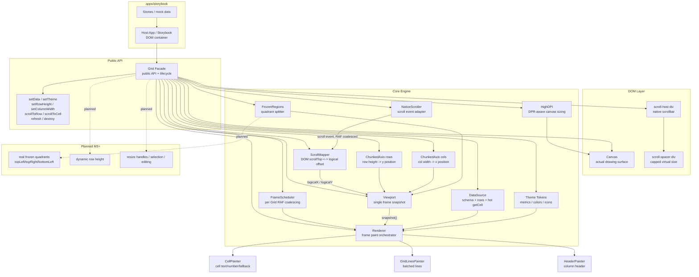
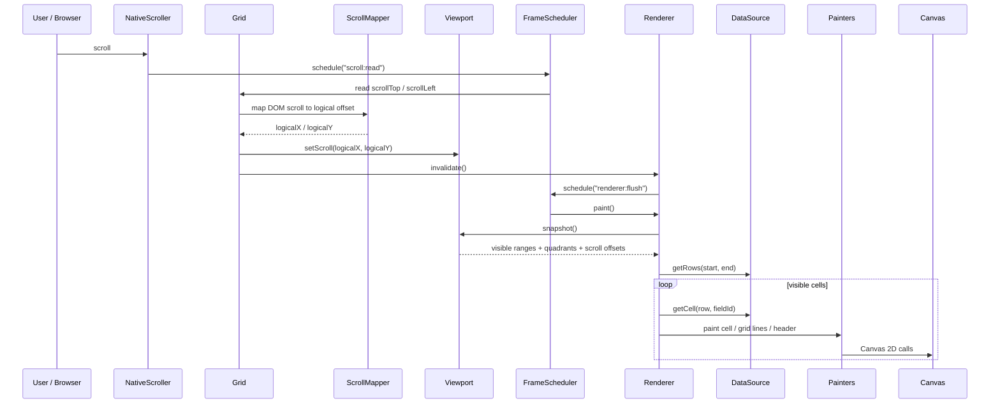
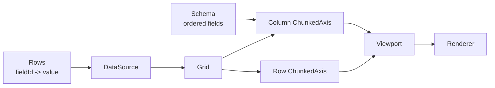
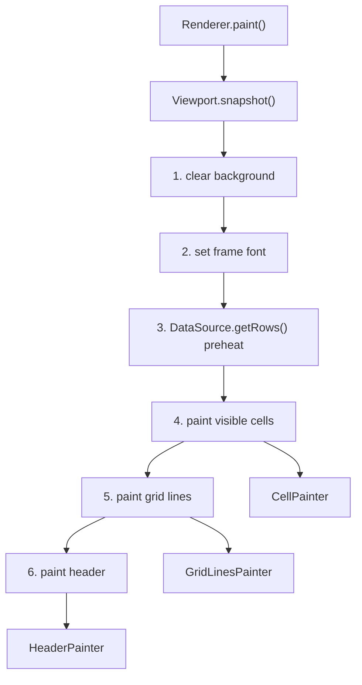

# NovaSheet 当前架构设计图

- **范围**：当前仓库源码状态
- **核心包**：`@novasheet/core`
- **当前状态**：源码已包含 M2 虚拟滚动与原生滚动映射；M3 冻结象限、动态行高、交互 resize 仍是 planned

---

## 1. 总体架构

核心关系：

- `Grid` 是唯一外部写入口，宿主应用只通过它修改数据源、主题、行高、列宽、滚动位置和生命周期。
- `Viewport.snapshot()` 是 `Renderer` 每帧唯一读取入口，用于避免绘制过程中直接读多个可变对象造成状态撕裂。
- `NativeScroller` 只负责读 DOM 原生滚动值，真实的大内容尺寸由 `ScrollMapper` 映射成逻辑坐标。
- `Renderer` 不做布局决策，只按快照调度 painter 绘制当前可见区域。

---

## 2. 单帧渲染流程

滚动路径：

1. 浏览器原生滚动发生在 `scroll-host`。
2. `NativeScroller` 把 scroll 事件合并到同一帧 RAF。
3. `Grid` 使用 `ScrollMapper` 将 DOM `scrollTop/scrollLeft` 转成逻辑内容坐标。
4. `Viewport.setScroll()` 更新视口状态。
5. `Renderer.invalidate()` 入队下一帧绘制。

---

## 3. 模块职责

| 层        | 关键文件                                                                                 | 职责                                                                       |
| --------- | ---------------------------------------------------------------------------------------- | -------------------------------------------------------------------------- |
| 门面      | `packages/core/src/Grid.ts`                                                              | 组装所有子系统；所有外部 mutation 入口；管理 DOM、生命周期、滚动映射、重绘 |
| 数据      | `packages/core/src/data/DataSource.ts`, `packages/core/src/data/InMemoryDataSource.ts`   | 抽象数据读取；`getCell` 是同步热路径；`getRows` 用于可见区预热             |
| Schema    | `packages/core/src/data/Schema.ts`                                                       | 定义字段、字段类型、行数据和值域                                           |
| 布局      | `packages/core/src/layout/ChunkedAxis.ts`                                                | 行高/列宽到像素位置的映射；支持百万行低内存定位                            |
| 视口      | `packages/core/src/layout/Viewport.ts`                                                   | 聚合尺寸、滚动、冻结配置，输出 Renderer 单帧快照                           |
| 冻结区    | `packages/core/src/layout/FrozenRegions.ts`                                              | 当前只返回 `main` 象限；M3 会扩展为 4 象限                                 |
| 滚动      | `packages/core/src/scroll/NativeScroller.ts`, `packages/core/src/scroll/ScrollMapper.ts` | 用原生滚动条承载大数据滚动；超过浏览器高度上限时做非线性映射               |
| 渲染      | `packages/core/src/render/Renderer.ts`                                                   | 清屏、预热数据、绘 cell、grid lines、header                                |
| Painter   | `packages/core/src/render/CellPainter.ts`, `GridLinesPainter.ts`, `HeaderPainter.ts`     | 具体 Canvas 绘制，不拥有业务状态                                           |
| DPR       | `packages/core/src/render/HighDPI.ts`                                                    | 将 CSS 像素坐标映射到高 DPR canvas bitmap                                  |
| 主题      | `packages/core/src/theme/Theme.ts`, `denseGridTheme.ts`                                  | 所有视觉 token 来源，渲染层不应硬编码颜色/尺寸                             |
| 调度      | `packages/core/src/util/raf.ts`                                                          | 每个 Grid 一个 RAF scheduler，scroll/render/resize 合帧                    |
| Storybook | `apps/storybook/src/`                                                                    | 用 stories 和 mock data 演示不同 Grid 配置                                 |

---

## 4. 数据与布局模型

关键约定：

- `Schema.fields` 决定列顺序和字段宽度。
- `DataSource.getRows(startIndex, endIndex)` 的 `endIndex` 是 inclusive。
- `DataSource.getCell(rowIndex, fieldId)` 是绘制热点，必须同步返回。
- `ChunkedAxis` 以 `CHUNK_SIZE = 1024` 分块；默认尺寸 chunk 不分配逐项数组，只有发生 override 时才懒分配。
- `ChunkedAxis.getSize(index)` 是单项尺寸的唯一安全来源，不能用 `indexToPosition(i + 1) - indexToPosition(i)` 替代。

---

## 5. 渲染管线

当前实现只绘制 `main` 象限。冻结行列的 `topLeft / topRight / bottomLeft` 类型和接口已经保留，但真正绘制逻辑在 M3 才会接入。

---

## 6. 关键不变量

| 不变量                              | 说明                                                     |
| ----------------------------------- | -------------------------------------------------------- |
| 所有 mutation 走 `Grid`             | painter、layout、renderer 不自行改变外部状态             |
| Renderer 只读 `Viewport.snapshot()` | 每帧只有一个不可变读取源                                 |
| Theme 是视觉唯一来源                | render 层不硬编码颜色、字体、尺寸                        |
| 每个 Grid 一个 `FrameScheduler`     | scroll、render、resize 同帧合并，避免跨 Grid key 冲突    |
| `Grid.destroy()` 幂等               | 取消 pending RAF，移除 DOM，恢复 container 原始 position |
| `DataSource.getRows` 端点 inclusive | 与 `ChunkedAxis.getVisibleRange()` 保持一致              |
| `ScrollMapper.SAFE_MAX = 6_000_000` | 避开 Firefox / iOS Safari 最大 scrollHeight 限制         |

---

## 7. 当前与后续边界

| 能力                                  | 当前状态                                   |
| ------------------------------------- | ------------------------------------------ |
| Canvas 网格渲染                       | 已实现                                     |
| Theme token                           | 已实现                                     |
| 高 DPR canvas                         | 已实现                                     |
| ChunkedAxis 双轴虚拟化                | 已实现                                     |
| 原生滚动 + 非线性映射                 | 已实现                                     |
| 程序化 `scrollToRow` / `scrollToCell` | 已实现                                     |
| 冻结行列 4 象限                       | planned，`FrozenRegions` 目前只返回 `main` |
| 动态行高 autofit                      | planned                                    |
| resize handle / selection / editing   | planned                                    |
| React wrapper                         | planned                                    |
| Playground 性能验证                   | planned                                    |
