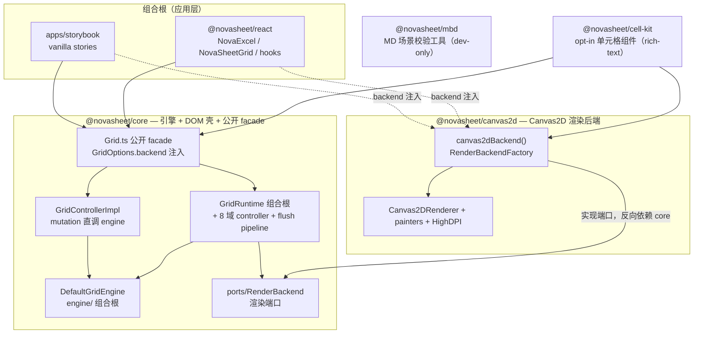
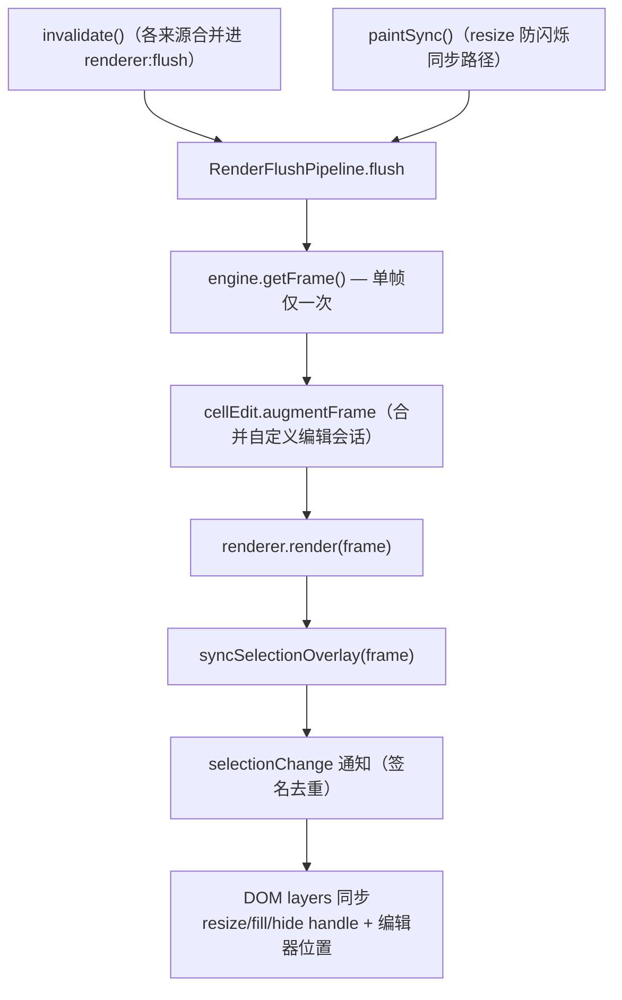
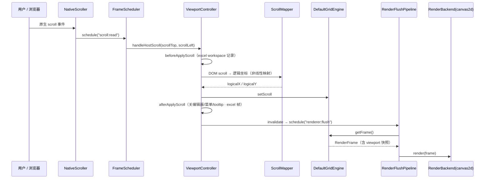
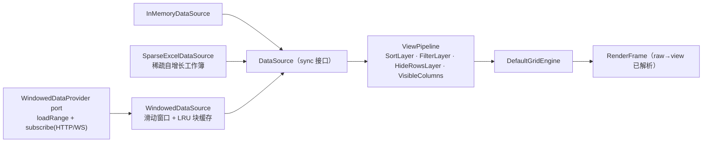

# NovaSheet 当前架构设计图

- **范围**：`main` 分支当前源码状态（2026-07，GridRuntime 分解合并后）
- **包**：`@novasheet/core` · `@novasheet/canvas2d` · `@novasheet/react` · `@novasheet/cell-kit` · `@novasheet/mbd`
- **对外入口**：`import { Grid } from '@novasheet/core'`，渲染后端经 `GridOptions.backend` 注入（`canvas2dBackend()`）；React 场景用 `@novasheet/react` 的 `<NovaExcel />` / `<NovaSheetGrid />`
- **能力状态**：Phase 4 全交付；Phase 5-A/5-B/5-C（合并 + 边框 + 值格式化）、单元格扩展 API、数据校验、WindowedDataSource 已交付；下一里程碑 Phase 5-D 条件格式

---

## 1. 包依赖与总体架构



**依赖方向（无环）**：`core` ← `canvas2d`；`react` / `cell-kit` / storybook 依赖二者并在组合根注入后端。**core `src/` 永不 import canvas2d** —— 渲染依赖经 `ports/RenderBackend.ts` 反转。

| 包                    | 职责                                                                                                                                                                             | 不含                  |
| --------------------- | -------------------------------------------------------------------------------------------------------------------------------------------------------------------------------- | --------------------- |
| `@novasheet/core`     | 全部状态与行为：数据、几何、选区、编辑、格式、合并、fill、剪贴板、undo/redo、校验 + DOM 壳（host/scroll/interaction/overlay/runtime）+ 公开 `Grid` facade + `RenderBackend` 端口 | 任何 Canvas 绘制      |
| `@novasheet/canvas2d` | `RenderBackend` 唯一 shipped 实现：`Canvas2DRenderer`、painters、HighDPI、`cellRenderers` 自定义绘制注册                                                                         | 引擎状态、DOM 编排    |
| `@novasheet/react`    | React 适配：`<NovaExcel />` Excel 壳、`<NovaSheetGrid />`、hooks、toolbar；一切能力最终调用公开 `Grid` 方法                                                                      | 引擎/渲染逻辑         |
| `@novasheet/cell-kit` | 第一方 opt-in 单元格组件（首个 rich-text：codec + canvas renderer + inline 编辑器 + React toolbar），与第三方扩展走同一注册路径                                                  | 默认打包进 core/react |
| `@novasheet/mbd`      | BDD 场景 MD 的 `validate`/`manifest` 工具链（dev-only）                                                                                                                          | 运行时代码            |

核心关系：

- **`Grid` 是唯一对外入口**；构造时注入 `backend`（`RenderBackendFactory`），`new Grid(container, { data, backend: canvas2dBackend() })`。
- **mutation 路径**：`Grid` → `GridControllerImpl` **直调** `DefaultGridEngine`，成功后按各方法语义调 `runtime.afterEngineMutation()` 收尾（格式/合并类返回 `false` 的 no-op **不**收尾）。`GridRuntime` 不再承担 mutation passthrough。
- **渲染路径**：`GridRuntime` → `engine.getFrame()` → `RenderFlushPipeline` → `renderer.render(frame)`；渲染后端只读 `Viewport` + `RenderFrame` 快照。
- 每个 `Grid` 实例自持一个 **`FrameScheduler`**（`scroll:read` / `host:resize` / `renderer:flush` 等同帧合并，禁止跨 Grid 共用单例）。

---

## 2. core 内部分层（纯层 / DOM 壳）

```text
─ 纯层（零 DOM · 可 node/worker · 脱 DOM 测）─────────────
kernel/          原语：geometry(ChunkedAxis/Viewport/FrozenRegions) · data(DataSource 家族)
                 theme · render(RenderFrame) · undo · protocol · coords · interaction · measure · util
    ↑
features/        领域垂直切片：row/column/selection/layout/fill/clipboard/view/edit/
                 format/merge/validation/attachment/cell-types/context-menu/excel-workspace
    ↑
engine/          组合根：DefaultGridEngine + GridEngine 接口
ports/           边界契约：RenderBackend 端口（可引用 DOM 类型，不依赖 dom/）
─ DOM 壳（browser-only · 单向依赖纯层）──────────────────
    ↑
dom/             host / scroll / interaction / overlay / clipboard / runtime
    ↑
Grid.ts          公开 facade：GridOptions.backend 注入渲染后端
```

**单向边界**：`dom/**` 可依赖纯层；纯层不得 import `dom/**`，`kernel|features|engine` 不得触碰 DOM 全局（`ports` 可用 DOM 类型）。由 `scripts/check-kernel-boundary.ts` 强制（`lint:architecture`）。

详细导航见 [`packages/core/src/ARCHITECTURE.md`](../packages/core/src/ARCHITECTURE.md) 与各子目录 `README.md`。

---

## 3. 运行时编排（`dom/runtime` — GridRuntime 分解后）

`GridRuntime` 从单文件 God object（2981 行）分解为**薄组合根（~1040 行）+ 8 个域 controller + 1 个 flush pipeline**（`dom/runtime/controllers/`）。组合模式沿用窄 deps-object + 闭包注入：GridRuntime 是唯一 wiring 点，**controller 之间零互相 import**（跨域调用一律经 deps 闭包指回 runtime 组合层）。

| 模块                    | 路径（`dom/runtime/`）                 | 职责                                                                                                                                    |
| ----------------------- | -------------------------------------- | --------------------------------------------------------------------------------------------------------------------------------------- |
| `GridRuntime`           | `GridRuntime.ts`                       | 组合根：构造并接线全部 controller，持有 `FrameScheduler`；`afterEngineMutation()` 统一收尾；`destroy()` 幂等扇出                        |
| `GridControllerImpl`    | `GridControllerImpl.ts`                | `Grid` facade 的实现载体：mutation 直调 engine + 等价收尾语义                                                                           |
| `RenderFlushPipeline`   | `RenderFlushPipeline.ts`               | `invalidate`/`paintSync`；**单帧恰好一次 `getFrame()`**，固定顺序 `render → selection overlay → selectionChange 通知 → DOM layers 同步` |
| `ViewportController`    | `controllers/ViewportController.ts`    | scroll/resize/DPR、spacer 尺寸、`scrollToRow/Cell`、`ensureCellVisible`；自持 `ScrollMapper`                                            |
| `InputController`       | `controllers/InputController.ts`       | `handleHostKeyDown`/pointer 路由：快捷键分派、编辑/拖拽/菜单的事件仲裁                                                                  |
| `CellEditController`    | `controllers/CellEditController.ts`    | 内建 + 自定义编辑器生命周期（open/commit/cancel/位置同步/frame 增强）                                                                   |
| `DragCoordinator`       | `controllers/DragCoordinator.ts`       | 5 个 Drag 实例（resize/fill/框选/列重排/行重排）编排 + auto-scroll                                                                      |
| `ContextMenuController` | `controllers/ContextMenuController.ts` | 菜单路由/内置动作/列头 hover 按钮/扩展项合并                                                                                            |
| `ClipboardController`   | `controllers/ClipboardController.ts`   | copy/cut/paste/undo/redo 与内部剪贴板缓存                                                                                               |
| `PopoverController`     | `controllers/PopoverController.ts`     | filter / 行高 / 列宽弹层                                                                                                                |
| `ExcelWorkspaceBinding` | `controllers/ExcelWorkspaceBinding.ts` | sparse Excel workspace 滚动扩容策略                                                                                                     |

DOM 壳的其余部分：`dom/host/`（`DomGridHost`、scroll-host/spacer/样式注入）、`dom/scroll/`（`ScrollMapper`、`NativeScroller`）、`dom/interaction/`（drag 类、handle layer、`DomCellEditor`、`DomContextMenuLayer`）、`dom/overlay/`（`SelectionOverlay`、popover、reorder overlay、`ValidationTooltip`）、`dom/clipboard/`（`DomClipboardAdapter`）。

---

## 4. 渲染管线与单帧 flush



- `@novasheet/canvas2d` 侧：`Canvas2DRenderer.render(frame)` 只读 frame 绘制；painters：`CellPainter`、`HeaderPainter`、`RowHeaderPainter`、`GridLinesPainter`、`FormatFillPainter`、`FormatBorderPainter`、`EmptyStatePainter`；HighDPI 位图管理在 `surface/`。
- 自定义单元格绘制经 `canvas2dBackend({ cellRenderers })` 注册，按 cell 的**解析后**类型选 painter。
- 冻结区（顶/左/右）已实装分区绘制与分隔线。

---

## 5. 滚动路径（单帧序列）



**Resize 路径（合并，防闪烁）**：`ResizeObserver` → `handleHostResize` → `schedule("host:resize")`，同帧内 `setViewportSize` → `renderer.resize`（位图）→ `remapScroll` → **`paintSync()`**（同步绘制，不走异步 flush）。

---

## 6. 数据与视图模型



关键约定：

- `DataSource.getRows(start, end)` 的 **`endIndex` inclusive**；`getCell` 是同步热路径。
- **raw/view 双坐标**：`RangeStyleStore`/`MergeStore`/`CellTypeStore`/attachment 全部 **raw** 键控；公开 mutation API 收 **view** 坐标、经 `viewRangeToRawRange` 转连续 raw 区间（sort/filter 打散时保守 no-op 返 `false`）；painter 只吃 **view** 坐标。
- `WindowedDataSource`：`Grid` 每帧 `hintWindow(visibleWindow)`（窗口不变即 no-op），经 Sort/Filter/Hide/VisibleColumns 装饰链透传；stale-while-revalidate epoch 协调 fetch 与 push。

---

## 7. 关键不变量

| 不变量                                 | 说明                                                                                                     |
| -------------------------------------- | -------------------------------------------------------------------------------------------------------- | -------- | ------ | ---------------------------------------------------------------- |
| 渲染后端只读 frame 契约                | 只从 `engine.getFrame()` 的 `Viewport`+`RenderFrame` 读，不碰 `ChunkedAxis`/`FrozenRegions`/`DataSource` |
| mutation 走 engine/facade              | `GridControllerImpl` 直调 `DefaultGridEngine`；facade 决定 invalidate，painter/layout 不自 invalidate    |
| flush 单帧契约                         | 一次 flush 恰好一次 `getFrame()`，顺序 render → overlay → 通知 → DOM layers                              |
| Theme 是视觉值唯一来源                 | canvas2d painters/render 内零硬编码 px/font/color                                                        |
| 每 Grid 一个 `FrameScheduler`          | 所有 RAF 源同帧合并；禁止跨 Grid 共用单例                                                                |
| `Grid.destroy()` 完全幂等              | cancel 全部 RAF、还原 container `position`、移除 canvas；StrictMode mount→destroy→mount 绿               |
| `ChunkedAxis.getSize(index)`           | 边界尺寸唯一访问器（末行不能用 position 差分）                                                           |
| 纯层/DOM 壳单向边界                    | `kernel                                                                                                  | features | engine | ports`不 import`dom/\*\*`；core 永不 import canvas2d（脚本强制） |
| `ScrollMapper.SAFE_MAX = 6_000_000` px | 跨端安全 spacer 高（Firefox ~17.9M / iOS ~16.7M 上限）                                                   |

---

## 8. 能力状态

| 能力                                                                                                                             | 状态                                           |
| -------------------------------------------------------------------------------------------------------------------------------- | ---------------------------------------------- |
| Canvas2D 渲染 + Theme + HighDPI + 双轴虚拟化（1M+ 行）                                                                           | ✅                                             |
| 原生滚动 + 非线性 `ScrollMapper` + `scrollToRow/Cell`                                                                            | ✅                                             |
| 冻结区（顶/左/右）分区绘制 · 动态行高 · autofit                                                                                  | ✅                                             |
| 选择/键盘导航/resize/编辑/右键菜单/剪贴板/undo-redo/填充柄/排序筛选/行列结构/列重排                                              | ✅（Phase 3–4 全量）                           |
| 合并 + 填充色 + 高级边框 + 值格式化（number/currency/percent/date + 自定义 formatter）+ text-wrap 三态                           | ✅（Phase 5-A/5-B/5-C）                        |
| 单元格扩展 API：`cellTypes` / `cellEditors` / `cellAttachments` / `cellRenderers`（backend 侧）+ per-cell `setCellType` override | ✅（参考实现 `@novasheet/cell-kit` rich-text） |
| 数据校验（sync/async `ValidatorDefinition`，全写入路径自动接线）                                                                 | ✅                                             |
| 远程滑动窗口数据源 `WindowedDataSource`                                                                                          | ✅                                             |
| React 适配 `@novasheet/react`（NovaExcel 壳 + hooks）                                                                            | ✅                                             |
| 条件格式（Phase 5-D）                                                                                                            | 下一里程碑                                     |
| 公式引擎 / 导入导出 / 多 sheet                                                                                                   | planned（Phase 7）                             |
| 协同 / OPFS / 多视图（Kanban/Calendar/…）                                                                                        | planned（Phase 8）                             |
| WebGL/WebGPU 后端（`RenderBackend` 第二实现）                                                                                    | planned                                        |
| Vue 适配                                                                                                                         | planned                                        |

---

## 9. 对外使用速查

```ts
// Vanilla
import { Grid, InMemoryDataSource, denseGridTheme } from '@novasheet/core'
import { canvas2dBackend } from '@novasheet/canvas2d'

const grid = new Grid(container, {
  data,
  theme: denseGridTheme,
  backend: canvas2dBackend(), // 必填：渲染后端注入
  frozen: { topRows: 1, leftCols: 1 },
})
```

```tsx
// React
import { NovaExcel } from '@novasheet/react'
export const App = () => <NovaExcel className="h-[600px] w-full" />
```

- 引擎、类型与数据：`@novasheet/core`（[README](../packages/core/README.md)）
- Canvas2D 后端与自定义 painter：`@novasheet/canvas2d`
- React 组件：`@novasheet/react`（[README](../packages/react/README.md)）
- 高级定制：实现 `ports/RenderBackend.ts` 端口即可替换整个渲染层（WebGL、测试 stub）
