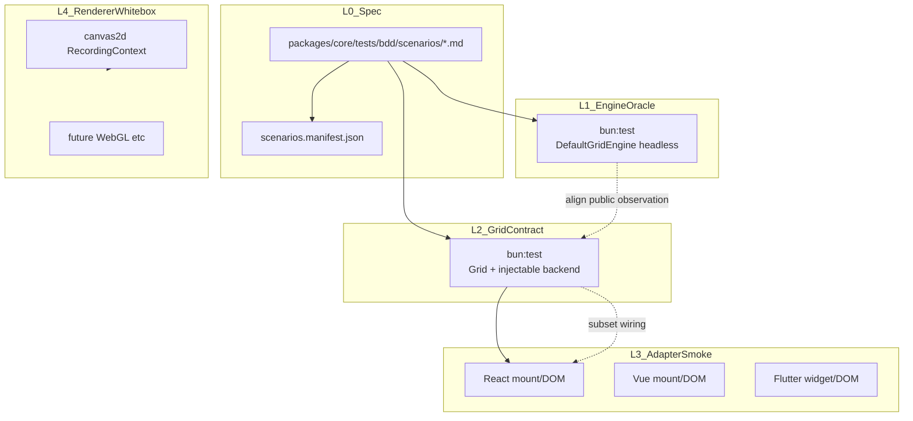

# NovaSheet 行为测试终态 — 设计

- **日期**：2026-06-08
- **状态**：设计（**Phase 1 执行中** — Core L0–L2 分批启动，Excel L3 继续维护）
- **分支**：`refactor-default-grid-engine-decomposition`（延续 decomposition；暂不合 `main`）
- **相关**：`packages/canvas2d/tests/integration/Phase45–47.scenarios.test.ts`、`packages/core/src/Grid.ts`、`packages/react/docs/project-standards.md`

---

## Phase 1 — 当前执行范围

Core 公开 API 进入 BDD 分批覆盖阶段：Core L0/L1/L2 场景统一放在 `packages/core/tests/bdd/scenarios/*.md`，由 `@novasheet/mbd` 解析/manifest，手写 `bun:test` 覆盖 `Grid` / `DefaultGridEngine` / `DataSource` / view / format / undo 等公开可观测行为。Excel L3 继续维护为组合层烟测，不再承担 Core 深层行为断言。
截至 2026-06-11，Core BDD 路线计划见 `docs/superpowers/plans/2026-06-11-novasheet-core-public-api-bdd-roadmap.md`。

### 两类测试，不可混用

| 类型 | Core | Excel（`packages/react/tests/excel/`） |
| --- | --- | --- |
| **TDD**（单元 / 领域 / 引擎） | **继续** — `kernel/`、`features/`、`engine/` 红→绿→重构 | 不适用（组合层用行为测驱动） |
| **行为测试**（端到端 / 用户旅程） | **启动** — 分批建设 `packages/core/tests/bdd`，L0/L1/L2 覆盖公开 API 契约 | **继续维护** — 壳层、接线、用户旅程 |

```text
Core 实现  ←—— TDD（细、快、白盒）———————————— 持续进行
Core 行为  ←—— Core MBD 场景 / 手写 bun:test 行为测试 —— Phase 1 分批启动
Excel 行为 ←—— NovaExcel 大组件旅程 / 接线 ————————— 持续维护
```

### Phase 1 断言边界

| 测（Core L0–L2 可观测） | 不测（继续留给 Core TDD / L4） |
| --- | --- |
| `Grid` / `DefaultGridEngine` 公开 API 后的数据、选区、undo、view、format 观测 | `ChunkedAxis` 二分 / 分块数学细节 |
| `DataSource` 公开读写、事件、schema、稀疏工作区行为 | painter `RecordingContext` 序列 |
| row/column structure、clipboard、fill、format、merge、sort/filter 的公开观测结果 | DOM drag 命中、像素级绘制 |
| Grid 门面回调 / 事件 / destroy 幂等 / scroll facade 基本契约 | React hook 内部状态、toolbar 私有实现 |

**底线**：现有 `packages/core/tests`（~900 `it`）保持绿并随功能 **TDD 增长**；`lint:architecture` 继续跑。BDD 不替换 kernel / features / engine 单元测试，只把公开可观测契约提升为场景化测试。

### Phase 1 分批启动信号

Core L0–L2 立即启动，但按批次提交，避免一次性大改压垮维护：

- 第 0 批只建 `packages/core/tests/bdd` 骨架和 3–5 条 smoke 场景。
- 第 1–2 批锁结构 / view / selection / undo 这些最容易 regression 的 API。
- 第 3–5 批再覆盖 clipboard / fill / format / merge / DOM Grid 门面。
- 每批都必须 Core `mbd validate` / `manifest`、BDD 测试红绿、`bun test packages/core/tests/bdd`、全仓关键 gates 通过。

### Phase 0 excel 行为测试分层

| 子层 | 路径 | 目标条数（建议） |
| --- | --- | ---: |
| **L3a 壳层契约** | `tests/excel/NovaExcel.test.ts` | ~8（含 StrictMode、props 回调） |
| **L3b 接线契约** | `tests/excel/NovaExcel.toolbar-wiring.test.ts`（或同文件分 describe） | ~12（toolbar → `grid.*` spy） |
| **L3c 用户旅程** | `tests/excel/NovaExcel.journeys.test.ts` | ~5（只断言 UI / 回调，不断言引擎数据） |

`tests/features/toolbar/` 保留孤立 UI 与 `deriveToolbarState` 纯函数单测；**不**在 feature 层扩「merge→undo 数据链」。详见附录 C。

---

## 1. 背景与目标

NovaSheet 是 Canvas 表格引擎 + 多端适配（React 已 ship，Vue / Flutter 规划中）。引擎重构、渲染后端替换（canvas2d → 未来 WebGL 等）、跨端复用时，**不能依赖各端复制 `.test.ts` 源码**来维持行为一致。

大型开源项目的通行做法：

| 项目 | 模式 |
| --- | --- |
| **typescript-go** | 移植 ~2 万 compiler 合规用例；`tsc` 与 `tsgo` 双跑；baseline diff |
| **WPT** | 中央 HTML/JS 场景；Chromium / Firefox / WebKit 各自 import 对齐 |
| **SWC / esbuild** | 换实现不换验收；同一 Jest 用例 + 生态 interop 矩阵 |

**本规格目标**：为 NovaSheet 定义 **中央行为合规套件（L0）+ 分层测试（L1–L4）**，支撑：

1. 引擎重构 / 换语言（如 Dart）时，L1 oracle 不变
2. 换渲染后端时，L2 Grid 契约不变
3. 扩 Vue / Flutter 时，共享 MBD 场景语义，各端仅写 L3 冒烟

### 现状基线

| 层 | 位置 | 规模 | 角色 |
| --- | --- | ---: | --- |
| 纯层 / 引擎 | `packages/core/tests/` | ~901 `it` | 算法、领域、脱 DOM 引擎 |
| 渲染后端 | `packages/canvas2d/tests/` | ~175 `it` | Grid 集成 + painter 录制 |
| E2E 雏形 | `packages/canvas2d/tests/integration/Phase45–47.*` | ~10 `it` | 唯一门面场景集 |
| React 适配 | `packages/react/tests/` | ~28 `it` | 挂载 / DOM 契约 / toolbar 分发 |

**缺口**：无 backend 无关中央场景层；clipboard / fill / format-merge 无门面 E2E；`Grid.test.ts` 大量 `delegate.engine` 穿透；`RecordingContext` 不可跨端移植。

---

## 2. 非目标

1. **不替换、不削弱 Core TDD**——`kernel/`、`features/`、`engine/` 单元测试继续红→绿驱动实现；Phase 1 只新增公开契约 BDD，不复制白盒细节
2. **不替换**现有 `canvas2d/tests` 渲染白盒（L4）——中央场景将来是 **收敛门面行为**，不是削减 painter / DOM mock 覆盖
3. **默认不引入** Playwright 作为 PR 门禁（scroll / DPR / 系统剪贴板权限留给可选 nightly 或手测）
4. **不共享** React / Vue / Flutter 的 `.test.ts` 源码
5. **不一次性迁移所有旧 E2E**——`packages/core/tests/bdd` 分批建设；Phase45–47 在 L2 覆盖稳定后再薄包装或下线
6. **不把** painter `RecordingContext` 指令序列上升为跨端契约
7. **Excel 行为测试不再承载 Core 深层语义**（rowCount 还原、view pipeline 重算等下沉到 L1/L2）

---

## 3. 设计原则

1. **测行为不测实现**——断言数据、选区、undo 栈、view 格式；不断言 painter ctx 序列或 React hook 内部
2. **规格与实现解耦**——场景为 MBD Markdown；测试代码手写，不再新增自定义解析层
3. **旧实现当 oracle**——`DefaultGridEngine` headless 为 L1 基准；`Grid` + injectable backend 为 L2 契约；必要场景对齐二者公开观测
4. **分层验收**——DOM 命中层（hide-toggle handle）与 API 层（`invokeRowHeaderContextMenuAction`）分开标注
5. **YAGNI**——P0 先迁移现有 10 条 E2E；P1 补 clipboard / format / fill 缺口；P2 随 milestone 追加

---

## 4. 四层验收模型



| 层 | 名称 | 入口 | 断言对象 | 跨端 | 现有测试归属 |
| --- | --- | --- | --- | --- | --- |
| **L0** | 中央场景规格 | MBD Markdown + manifest | 无（纯数据） | 是 | `packages/core/tests/bdd/scenarios/` |
| **L1** | 引擎 oracle | `DefaultGridEngine` | `data.getRowCount()`、`canUndo`、`getViewCellFormat`、`getViewPipeline().getComposed()` | 是 | **Phase 1 启动**；Core TDD 继续保留 |
| **L2** | Grid 门面契约 | `new Grid(el, { backend })` | 仅 `Grid` 公开 API + `DataSource` 观测 | 是 | **Phase 1 启动**；Phase45–47 后续迁移 |
| **L3** | 框架组合行为 | `NovaExcel` / 未来 Vue·Flutter | DOM 契约、ref、StrictMode、toolbar→`grid.*` 接线、用户旅程（浅断言） | 否 | `packages/react/tests/excel/` 持续维护；`features/` 仅孤立 UI / 纯函数 |
| **L4** | 渲染白盒 | `Canvas2DRenderer` / painters | `RecordingContext` 指令序列 | 否 | `packages/canvas2d/tests/painters/` |

**铁律**：L0–L2 **禁止** `delegate.engine` / `canvas2dDelegate` 穿透。现有 `Grid.test.ts` 白盒回归可保留，但不得进入中央场景目录。

---

## 5. L0 场景规格（MBD Markdown 契约）

### 5.1 目录结构（实现期创建）

```text
packages/core/
  mbd.config.ts
  tests/bdd/
    scenarios/
      L0-*.md
      L1-*.md
      L2-*.md
    core-bdd.test.ts
    scenarios.manifest.json
    SCENARIOS.md
```

### 5.2 单场景结构

```markdown
---
id: core.L1.engine-frame-initial-visible-range
title: Engine frame exposes the initial visible range
layer: L1
area: engine
---

## User Story

作为 Core 维护者，我需要 headless engine frame 暴露稳定的初始可见区。

## Given

- dense 2x2 datasource

## When

- 调用 `DefaultGridEngine.getFrame()`

## Then

- rows/cols/cells 均可通过公开 frame 观测
```

**字段约定**：

| 字段 | 必填 | 说明 |
| --- | --- | --- |
| `id` | 是 | 全局唯一；Core 使用 `core.L[012].slug` |
| `layer` | 是 | `L0` / `L1` / `L2` |
| `area` | 是 | `engine` / `grid` / `datasource` / `format` 等领域标签 |
| `title` | 是 | 人读标题；测试 title 仍必须以 `id` 开头 |
| `## User Story` | 是 | 行为意图 |
| `## Given/When/Then` | 是 | 行为契约，供人读与 review；测试代码手写实现断言 |

### 5.3 Layer 标注约定

| `layer` 值 | 含义 | 测试实现 |
| --- | --- | --- |
| `L0` | public pure / datasource 输入输出契约 | `bun:test` 直接调用公开函数或 datasource |
| `L1` | headless engine 契约 | `bun:test` 直接调用 `DefaultGridEngine` |
| `L2` | `Grid` facade 契约 | `bun:test` 挂载 `Grid` + mock backend |

**happy-dom 限制**（沿用 Phase45 注释策略）：容器默认宽高为 0 时 viewport 可见范围为 `[0,0]`，`syncHideToggleHandles` 不创建 DOM。hide → unhide 链路在 L2 通过 `invokeRowHeaderContextMenuAction('unhide-rows')` 或公共 `unhideRows` API 验收，不测 handle 点击。

---

## 6. L1 / L2 测试语义

- **L1 构造**：`new DefaultGridEngine({ data, theme, frozen })`；不经 DOM、不经 `GridController`。
- **L2 构造**：`new Grid(container, { backend, data, theme, frozen })`；每场景 `grid.destroy()` + `container.remove()`。
- **断言来源**：只断言公开 API 可观测结果，例如 `DataSource`、`Grid.canUndo()`、`Grid.getSelection()`、`getViewCellFormat()`、`getViewPipeline()`。
- **禁止**：`delegate.engine`、`canvas2dDelegate`、`engineOf`。
- **contract drift**：L1/L2 公开观测不一致时，优先修 Grid 转发层或补公开观测 API，禁止静默改场景期望。

---

## 7. 场景目录（终态清单）

### 7.1 P0 — 迁移现有 E2E（10 条）

来源：`packages/canvas2d/tests/integration/Phase45–47.scenarios.test.ts`

| ID | 来源测试名摘要 | layer | 关键断言 |
| --- | --- | --- | --- |
| `structural.insert-rows-undo` | insertRows + undo 还原 rowCount | engine, grid | `data.rowCount` 7→5；`canUndo` true→false |
| `structural.insert-rows-undo-redo` | insert + undo + redo 循环 | engine, grid | rowCount 3→4→3→4 |
| `view.sort-delete-rows-rebuild` | sort 激活下 deleteRows | engine, grid | raw 5→4；`view.composedRowCount` 4 |
| `structural.hide-delete-rows-remap` | hideRows 后 deleteRows 重映射 hidden ids | engine, grid | `hiddenRows` [2,3]→[1,2] |
| `structural.hide-unhide-menu-item` | hide 后行头菜单含 unhide-rows | grid | `menu.contains` unhide-rows |
| `structural.hide-unhide-undo-redo` | hide/unhide API + undo/redo | engine, grid | `hiddenRows` 循环 |
| `structural.insert-cols-undo-frozen` | insertCols + undo 含 frozen | grid | schema 长度；**frozen 需 `grid.frozenConfig` 公开 API**（当前 Phase46 用 `engineOf`，迁移前须补门面或改间接断言） |
| `view.sort-delete-cols-invalidate` | deleteCols 使 sort spec invalidate | engine, grid | `view.sortSpec` null |
| `structural.hide-cols-anchor` | hideCols + insertCols 锚定 fieldId | engine, grid | `hiddenCols` 仍为 `['c']` |
| `structural.move-cols-hidden-undo-redo` | moveCols 保留 cell / hidden / undo | engine, grid | `schema.fieldOrder`；`data.cell`；`hiddenCols` |

### 7.2 P1 — 补当前缺口（门面级，15 条建议）

| 域 | ID 示例 | 场景数 | 关键链 |
| --- | --- | ---: | --- |
| clipboard | `clipboard.copy-paste-undo` | 4 | copy→paste→undo；cut→paste；类型 skip；空选区 no-op |
| format | `format.fill-color-undo` | 6 | setFillColor→undo；merge→fill；border preset；textWrap 切换 |
| fill | `fill.range-commit-undo` | 3 | 程序化 fill 提交→undo；含 format/merge 快照（对齐 `2026-05-30-novasheet-fill-handle-merge-format-integration.md`） |
| autofit | `layout.autofit-rows-undo` | 2 | `autofitRows` 改变 row axis；undo 还原 |

### 7.3 P2 — 未来 milestone

| 域 | 触发条件 |
| --- | --- |
| 5-C number/date format | Phase 5-C spec 冻结后追加 MBD 场景 |
| 5-D conditional formatting | 同上 |
| excel-workspace auto-grow | workspace policy 公开后 |
| dom-hit hide-toggle | Playwright 可选 job |

---

## 8. 与现有测试包的分工

| 问题 | 决策 |
| --- | --- |
| Core TDD vs Core 行为？ | **TDD 继续**（`kernel/`、`features/`、`engine/`）；**行为测试（L0–L2）Phase 1 分批启动** |
| 删除 `core/tests` / `canvas2d/tests`？ | **否**——Core TDD 与 L4 继续增长 |
| `Phase45.scenarios.test.ts` 去向？ | Phase 1 **保留不动**；L2 覆盖稳定后迁移到 MBD 场景，薄包装或删除 |
| `Grid.test.ts` delegate 用法？ | 保留白盒回归；新场景不得复制；新 L2 场景只走公开 `Grid` |
| `makeMockGridEngine` duplicate？ | 仅 core/canvas2d DOM 交互单测；**不进入 Core BDD 场景** |
| React excel 行为测试？ | **持续维护**——壳层 + 接线 + 浅旅程；Core 深断言下沉 L1/L2；见附录 C |
| `tests/features/toolbar/`？ | 孤立 `NovaSheetToolbar` UI + `deriveToolbarState` 纯函数；**不扩** merge→undo 数据链 |
| `deriveToolbarStateFromGrid`？ | 纯函数单测留 `features/toolbar`；未来可升为 `ExcelToolbarOrchestrator` |

---

## 9. 跨端适配（Vue / Flutter）

### 9.1 共享 vs 独有

| 共享 | 各端独有 |
| --- | --- |
| L0/L1/L2 MBD 场景 | L3 挂载冒烟（5–15 条 / 端） |
| 公开观测语义 | DOM / Widget 探针命名 |
| L2 `Grid` facade 测试语义（TS） | Dart facade 行为测试（Flutter，复用场景语义） |

### 9.2 DOM 契约（统一命名，实现期迁移）

| 属性 | 用途 | 现状 |
| --- | --- | --- |
| `data-novasheet-excel` | 组合根 | React 暂用 `data-novasheet-react-excel` |
| `data-novasheet-grid` | Grid 宿主 | React 暂用 `data-novasheet-react-grid` |
| `data-action-id` | toolbar 动作探针（L3） | 已用 |
| `data-control-id` | 非动作控件（zoom、text-wrap） | 已用 |

### 9.3 ExcelToolbarOrchestrator（后续抽取）

- **意图**：将 `deriveToolbarStateFromGrid` + action→`grid.*` 映射升为纯 TS 模块
- **测试**：L1 单测 orchestrator；L3 各端只测 UI 分发是否调用 orchestrator
- **位置建议**：`packages/core/src/features/excel-workspace/` 或独立 `packages/excel-toolbar/`（实现期决策）

---

## 10. CI 与质量门禁

```text
bun test                          # 现有全量（保持）
bun test packages/core/tests/bdd  # Phase 1：Core L0+L1+L2 BDD 测试
bun run lint:architecture         # kernel / react boundary
```

| 门禁 | 内容 |
| --- | --- |
| 默认 PR | 全量 `bun test` + lint + typecheck + build |
| Core BDD 合入后 | `packages/core/tests/bdd` 绿 + Core 场景 100% |
| 可选 nightly | Playwright `dom-hit` 子集 |
| Baseline | L1 `ObservationSnapshot` 受控 accept；首次引入需 review |

---

## 11. 迁移路线

| 阶段 | 交付 | 依赖 |
| --- | --- | --- |
| **0. excel-first（完成）** | `tests/excel/` L3a/L3b/L3c；Core **TDD** 照常 | `2026-06-10-novasheet-react-behavioral-testing-consolidation-design.md` |
| **1. 规格** | 本文档 + react standards + CLAUDE.md 索引 | ✅ |
| **2. Core BDD 基础设施（当前）** | `packages/core/tests/bdd`、`mbd.config.ts`、smoke MBD 场景 | `2026-06-11-novasheet-core-public-api-bdd-roadmap.md` |
| **3. 场景补全** | P1 clipboard/format/fill；Phase45–47 薄包装下线；excel 深断言**下沉**到 L2 | 阶段 2 绿 |
| **4. 跨端** | Vue L3 冒烟；`data-novasheet-excel` 统一；Flutter 复用场景语义 | 阶段 3 + 各端包存在 |

实现 plan：`docs/superpowers/plans/2026-06-11-novasheet-core-public-api-bdd-roadmap.md`

---

## 12. ADR

### ADR-A：MBD Markdown vs Gherkin (.feature)

| 方案 | 优点 | 缺点 |
| --- | --- | --- |
| **MBD Markdown 场景**（采纳） | 已在 React Excel 路径验证；`@novasheet/mbd` 统一解析/manifest；人读友好 | 结构化 action/assert 需由测试代码手写承接 |
| Gherkin | 产品 / QA 可读 | 需 step definition 层；Flutter/Dart 需另套 binding |

**决策**：Core L0/L1/L2 用 **MBD Markdown + 手写 `bun:test`**；场景只写行为契约，不新增自定义 YAML 解析器。

### ADR-B：Engine oracle vs 仅 Grid E2E

| 方案 | 优点 | 缺点 |
| --- | --- | --- |
| **L1 + L2 对齐**（采纳） | 脱 DOM 快；可服务 Dart 引擎；能抓 Grid 转发 drift | 需要维护公开观测 API |
| 仅 Grid E2E | 实现简单 | 绑 canvas2d + DOM；换引擎无 oracle |

**决策**：能同时覆盖 L1/L2 的场景应保持公开观测一致；contract drift 优先修门面或补公开观测 API，而非改期望。

### ADR-C：是否替换现有单元测试

**决策**：**不替换**。中央场景收敛 **用户可见门面行为**；kernel 算法、painter 录制、DOM 交互 mock 仍留在原包。Core BDD 场景按公开 API 路线批次增长，而非复制 ~1076 `it`。

### ADR-D：Core L0–L2 启动策略

| 方案 | 优点 | 缺点 |
| --- | --- | --- |
| **分批启动 L0–L2（采纳，Phase 1）** | 公开 API 契约早锁；每批可独立验证；Excel 深断言可下沉 | 需要维护公开观测 API |
| 一次性全量 L0–L2 | 一轮覆盖所有 API | diff 巨大；场景设计风险集中爆发 |
| 继续 excel-first | 产品入口维护成本低 | Core 公开契约缺少独立真相 |

**决策**：解除 Core L0–L2 行为层暂缓，按 `2026-06-11-novasheet-core-public-api-bdd-roadmap.md` 分批建设 `packages/core/tests/bdd`。Excel L3 继续保留，但 Core 深层行为以 Core BDD 场景为准。

---

## 附录 C：Phase 0 excel 行为场景清单

> **场景源（实现期）**：`packages/react/tests/excel/scenarios/*.md`，由 [`@novasheet/mbd`](./2026-06-09-novasheet-mbd-package-design.md) 导出 `scenarios.manifest.json`；场景结构覆盖率由 `@novasheet/react` `lint:scenario-coverage` 读 manifest 计算。下表为索引；权威 `id` 以 MD frontmatter 为准。可选 **`## User Story`**（用户故事，正文节、可长文）导出进 `SCENARIOS.md` 供产品/文档阅读，不参与测试匹配。

实现期写入 `packages/react/tests/excel/scenarios/`（以下为规格索引，非代码承诺）。

### L3a — 壳层契约

| 场景 | 断言 |
| --- | --- |
| 默认挂载 | `data-novasheet-react-excel`、grid、toolbar、canvas |
| `showToolbar: false` | 无 toolbar，grid 仍在 |
| 无 `data` prop | 内部 `SparseExcelDataSource` + canvas |
| ref | `grid`、`scrollToCell` 存在 |
| Strict Mode 双挂载 | 二次 mount 后 canvas 不泄漏、ref 可用 |
| props 透传 | `onSelectionChange` 等回调可触发 |

### L3b — 接线契约（`spyOn(ref.current.grid, …)` 或 `onToolbarAction`）

| 用户操作 | 断言 |
| --- | --- |
| undo / redo | 对应 `grid.undo` / `grid.redo`；`onToolbarAction` |
| copy / cut / paste | 对应 `grid.copy` / `cut` / `paste` |
| fill 色 / border / merge / unmerge / text-wrap | 对应 `setFillColor` / `setBorders` / `mergeCells` / `unmergeCells` / `setTextWrap` |
| 无选区时 format | 默认选区后仍调用写 API |
| `canUndo=false` | undo 在 `disabledActionIds` |
| 选区变化 | `onSelectionChange` + toolbar state 同步 |

### L3c — 用户旅程（浅断言）

| 旅程 | Then（仅 excel 面） |
| --- | --- |
| 填色后工具栏反映 | toolbar `fillColor` 更新；`onToolbarAction` |
| undo 按钮态 | 可 undo 操作后 undo 可点；undo 后 disabled |
| 隐藏工具栏仍用 grid | `showToolbar: false` 时 `ref.scrollToCell` 不报错 |
| 稀疏表默认工作区 | 无 data 时 ref.grid 可用 |
| 外部监听 | `onUndo` / `onRedo` 与 toolbar 联动各触发 |

---

## 附录 A：Fixture 约定

```json
{
  "schema": {
    "fields": [
      { "id": "a", "name": "A", "type": "text", "width": 100 }
    ]
  },
  "rows": [
    { "a": "r0" },
    { "a": "r1" }
  ],
  "frozen": { "topRows": 0, "leftCols": 0, "rightCols": 0 }
}
```

- `rows` 使用 **field id** 键，与 `InMemoryDataSource` 一致
- 行 id 由 DataSource 分配；结构测试用 **underlying row index**（与 Phase45 `deleteRows([0])` 一致）
- 扩展字段：`initialSelection`、`initialHiddenRows`、`initialSortSpec`（given 覆盖）

## 附录 B：P0 迁移对照（Phase45 文件行号）

| Phase45 `it` | MBD `id` |
| --- | --- |
| L40 insertRows undo | `structural.insert-rows-undo` |
| L58 undo/redo | `structural.insert-rows-undo-redo` |
| L82 sort deleteRows | `view.sort-delete-rows-rebuild` |
| L105 hide delete remap | `structural.hide-delete-rows-remap` |
| L132 menu unhide item | `structural.hide-unhide-menu-item` |
| L154 hide unhide undo | `structural.hide-unhide-undo-redo` |

| Phase46 `it` | MBD `id` |
| --- | --- |
| L46 insertCols frozen | `structural.insert-cols-undo-frozen` |
| L66 deleteCols sort | `view.sort-delete-cols-invalidate` |
| L81 hideCols anchor | `structural.hide-cols-anchor` |

| Phase47 `it` | MBD `id` |
| --- | --- |
| L31 moveCols hidden | `structural.move-cols-hidden-undo-redo` |
