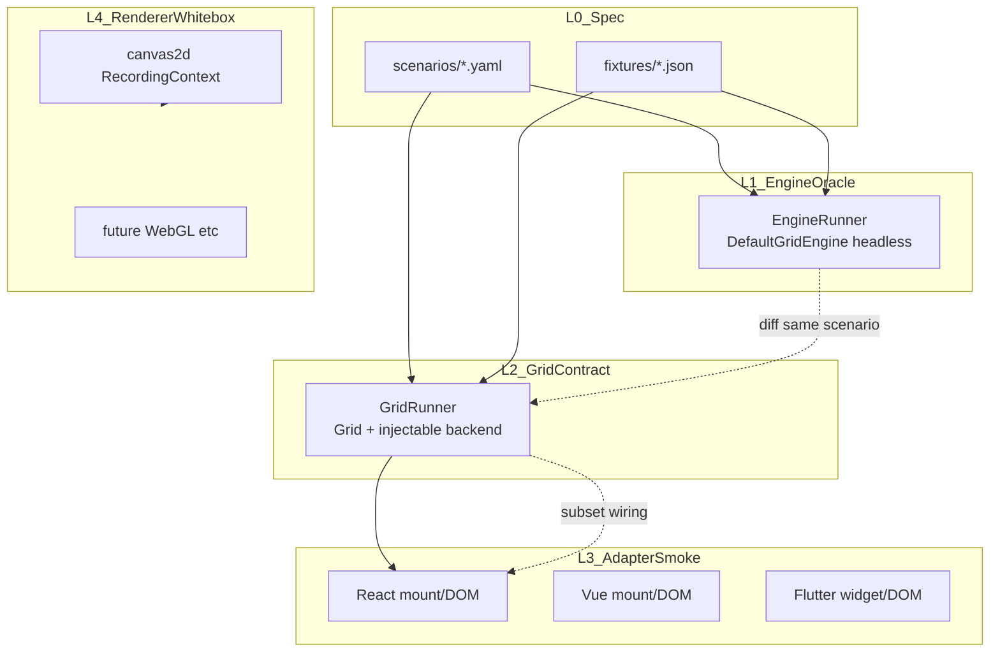
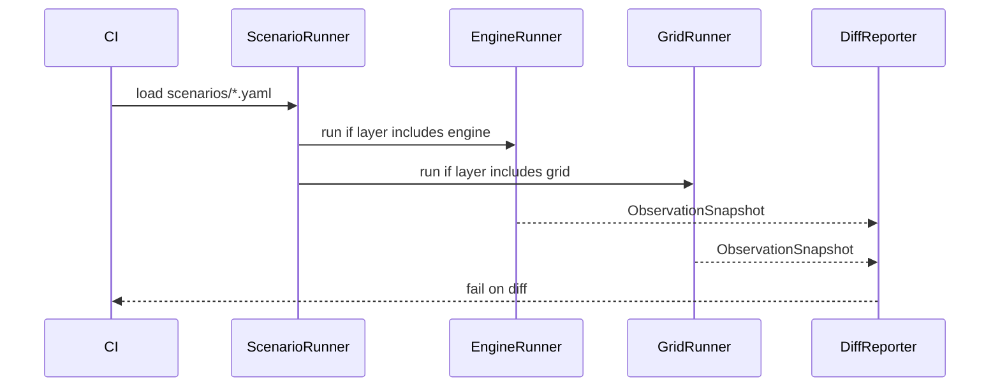

# NovaSheet 行为测试终态 — 设计

- **日期**：2026-06-08
- **状态**：设计（**Phase 0 执行中** — excel-first；L0–L2 暂缓）
- **分支**：`refactor-default-grid-engine-decomposition`（延续 decomposition；暂不合 `main`）
- **相关**：`packages/canvas2d/tests/integration/Phase45–47.scenarios.test.ts`、`packages/core/src/Grid.ts`、`packages/react/docs/project-standards.md`

---

## Phase 0 — 当前执行范围

核心库 API 与 decomposition 仍在演进，**产品行为先在 `NovaExcel` 组合层用大行为测试定型**；等功能冻结后再启用本文 §4–§7 的 L0–L2 中央合规（`packages/acceptance`）。
截至 2026-06-10，excel 行为测试 21 条场景 bootstrap 已完成，且 toolbar 同步、orphan lint、测试卫生巩固已按 `2026-06-10-novasheet-react-behavioral-testing-consolidation-design.md` 落地。

### 两类测试，不可混用

| 类型 | Core | Excel（`packages/react/tests/excel/`） |
| --- | --- | --- |
| **TDD**（单元 / 领域 / 引擎） | **继续** — `kernel/`、`features/`、`engine/` 红→绿→重构 | 不适用（组合层用行为测驱动） |
| **行为测试**（端到端 / 用户旅程） | **暂缓** — 不扩 L0–L2、不新建 `acceptance`、不把 Phase45 当当前投入重点 | **主战场** — 壳层、接线、用户旅程 |

```text
Core 实现  ←—— TDD（细、快、白盒）———————————— 持续进行
Core 行为  ←—— 门面 E2E / L0–L2 / acceptance —— Phase 0 暂缓，API 冻结后启用
Excel 行为 ←—— NovaExcel 大组件旅程 / 接线 ——— Phase 0 现在做
```

### Phase 0 断言边界

| 测（excel 可观测） | 不测（留给 Core TDD 或未来 L2） |
| --- | --- |
| toolbar 点击 → 调用 `grid.*`（可 spy） | paste 后 `data.getCell` 是否正确 |
| `onToolbarAction` / `onUndo` / `onRedo` / `onSelectionChange` | undo 后 `rowCount` 是否还原 |
| `disabledActionIds`、`toolbarState` 与 Grid 同步 | sort × delete 的 ViewPipeline |
| props、ref、StrictMode、DOM 契约 | merge 区域几何、ChunkedAxis 数学 |
| 用户旅程中的 **UI 状态**（如填色后 toolbar 显示红色） | painter `RecordingContext` 序列 |

**底线**：现有 `packages/core/tests`（~900 `it`）保持绿并随功能 **TDD 增长**；`lint:architecture` 继续跑。Phase 0 是**暂缓 Core 行为层加深**，不是放弃 Core 测试。

### Phase 0 → Phase 2 切换信号

满足 **2–3 条** 后启动 L0–L2 / `packages/acceptance`：

- MVP 功能列表 closed（如 Phase 5-C/D 或自定里程碑）
- `Grid` 公开 API 一季内无 breaking rename
- decomposition 合入 `main` 且稳定
- excel 行为测试连续 2–4 周无「为迁就 core bug 而改期望」

### Phase 0 excel 行为测试分层

| 子层 | 路径 | 目标条数（建议） |
| --- | --- | ---: |
| **L3a 壳层契约** | `tests/excel/NovaExcel.test.ts` | ~8（含 StrictMode、props 回调） |
| **L3b 接线契约** | `tests/excel/NovaExcel.toolbar-wiring.test.ts`（或同文件分 describe） | ~12（toolbar → `grid.*` spy） |
| **L3c 用户旅程** | `tests/excel/NovaExcel.journeys.test.ts` | ~5（只断言 UI / 回调，不断言引擎数据） |

`tests/features/toolbar/` 保留孤立 UI 与 `deriveToolbarState` 纯函数单测；**不**在 feature 层扩「merge→undo 数据链」。详见附录 C。

---

## 1. 背景与目标

NovaSheet 是 Canvas 表格引擎 + 多端适配（React 已 ship，Vue / Flutter 规划中）。引擎重构、渲染后端替换（canvas2d → 未来 WebGL 等）、跨端复用时，**不能依赖各端复制 `.test.ts` 源码**来维持行为一致。

大型开源项目的通行做法：

| 项目 | 模式 |
| --- | --- |
| **typescript-go** | 移植 ~2 万 compiler 合规用例；`tsc` 与 `tsgo` 双跑；baseline diff |
| **WPT** | 中央 HTML/JS 场景；Chromium / Firefox / WebKit 各自 import 对齐 |
| **SWC / esbuild** | 换实现不换验收；同一 Jest 用例 + 生态 interop 矩阵 |

**本规格目标**：为 NovaSheet 定义 **中央行为合规套件（L0）+ 分层 runner（L1–L4）**，支撑：

1. 引擎重构 / 换语言（如 Dart）时，L1 oracle 不变
2. 换渲染后端时，L2 Grid 契约不变
3. 扩 Vue / Flutter 时，共享 L0 YAML，各端仅写 L3 冒烟

### 现状基线

| 层 | 位置 | 规模 | 角色 |
| --- | --- | ---: | --- |
| 纯层 / 引擎 | `packages/core/tests/` | ~901 `it` | 算法、领域、脱 DOM 引擎 |
| 渲染后端 | `packages/canvas2d/tests/` | ~175 `it` | Grid 集成 + painter 录制 |
| E2E 雏形 | `packages/canvas2d/tests/integration/Phase45–47.*` | ~10 `it` | 唯一门面场景集 |
| React 适配 | `packages/react/tests/` | ~28 `it` | 挂载 / DOM 契约 / toolbar 分发 |

**缺口**：无 backend 无关中央场景层；clipboard / fill / format-merge 无门面 E2E；`Grid.test.ts` 大量 `delegate.engine` 穿透；`RecordingContext` 不可跨端移植。

---

## 2. 非目标

1. **不替换、不削弱 Core TDD**——`kernel/`、`features/`、`engine/` 单元测试继续红→绿驱动实现；Phase 0 仅 **暂缓 Core 行为测试（L0–L2）加深**
2. **不替换**现有 `canvas2d/tests` 渲染白盒（L4）——中央场景将来是 **收敛门面行为**，不是削减 painter / DOM mock 覆盖
3. **默认不引入** Playwright 作为 PR 门禁（scroll / DPR / 系统剪贴板权限留给可选 nightly 或手测）
4. **不共享** React / Vue / Flutter 的 `.test.ts` 源码
5. **Phase 0 不创建** `packages/acceptance` 代码（API 冻结后见 §11 阶段 2）
6. **不把** painter `RecordingContext` 指令序列上升为跨端契约
7. **Phase 0 不在 excel 行为测试中断言引擎深层语义**（rowCount 还原、view pipeline 重算等）

---

## 3. 设计原则

1. **测行为不测实现**——断言数据、选区、undo 栈、view 格式；不断言 painter ctx 序列或 React hook 内部
2. **规格与实现解耦**——场景为语言无关 YAML；各端写 adapter runner
3. **旧实现当 oracle**——`DefaultGridEngine` headless 为 L1 基准；`Grid` + injectable backend 为 L2 契约；同场景 **双跑 diff**
4. **分层验收**——DOM 命中层（hide-toggle handle）与 API 层（`invokeRowHeaderContextMenuAction`）分开标注
5. **YAGNI**——P0 先迁移现有 10 条 E2E；P1 补 clipboard / format / fill 缺口；P2 随 milestone 追加

---

## 4. 四层验收模型



| 层 | 名称 | 入口 | 断言对象 | 跨端 | 现有测试归属 |
| --- | --- | --- | --- | --- | --- |
| **L0** | 中央场景规格 | YAML + fixture | 无（纯数据） | 是 | 新建（本规格定义） |
| **L1** | 引擎 oracle | `DefaultGridEngine` | `data.getRowCount()`、`canUndo`、`getViewCellFormat`、`getViewPipeline().getComposed()` | 是 | Core **TDD** 在 `engine/`、`features/`；**行为 oracle 暂缓**（Phase 0） |
| **L2** | Grid 门面契约 | `new Grid(el, { backend })` | 仅 `Grid` 公开 API + `DataSource` 观测 | 是 | Phase45–47 保留；**扩写暂缓**（Phase 0） |
| **L3** | 框架组合行为 | `NovaExcel` / 未来 Vue·Flutter | DOM 契约、ref、StrictMode、toolbar→`grid.*` 接线、用户旅程（浅断言） | 否 | **`packages/react/tests/excel/`（Phase 0 主战场）**；`features/` 仅孤立 UI / 纯函数 |
| **L4** | 渲染白盒 | `Canvas2DRenderer` / painters | `RecordingContext` 指令序列 | 否 | `packages/canvas2d/tests/painters/` |

**铁律**：L0–L2 **禁止** `delegate.engine` / `canvas2dDelegate` 穿透。现有 `Grid.test.ts` 白盒回归可保留，但不得进入中央场景目录。

---

## 5. L0 场景规格（YAML 契约）

### 5.1 目录结构（实现期创建）

```text
packages/acceptance/
  scenarios/
    structural/     # insert/delete/hide rows&cols, moveCols
    view/           # sort, filter, composed rowCount
    clipboard/      # copy/cut/paste + undo
    format/         # fill, border, textWrap, merge
    fill/           # fill handle commit + undo
  fixtures/
    sparse-5x3.json
    sparse-5x1.json
    sort-active.json
    cols-4x10.json
  schema/
    scenario.schema.json   # 可选 JSON Schema 校验
  src/
    run-scenario.ts
    adapters/
      engine-runner.ts
      grid-runner.ts
  tests/
    run-scenarios.test.ts
```

### 5.2 单场景结构

```yaml
id: structural.insert-rows-undo
layer: [engine, grid]       # 适用 runner；见 §5.5
tags: [phase-4.5, undo]
given:
  fixture: sparse-5x3
  selection: null
  # 可选：frozen, sortSpec, hiddenRows, hiddenCols
steps:
  - when:
      action: insertRows
      args: { beforeRow: 2, count: 2 }
    then:
      - assert: data.rowCount
        equals: 7
      - assert: grid.canUndo
        equals: true
  - when:
      action: undo
    then:
      - assert: data.rowCount
        equals: 5
      - assert: grid.canUndo
        equals: false
```

**字段约定**：

| 字段 | 必填 | 说明 |
| --- | --- | --- |
| `id` | 是 | 全局唯一，`domain.snake-case` |
| `layer` | 是 | `engine` \| `grid` \| `dom-hit` 数组 |
| `tags` | 否 | milestone / 域标签，供过滤 CI |
| `given.fixture` | 是 | `fixtures/` 下 JSON 文件名（无扩展名） |
| `given.selection` | 否 | `GridSelection` 或 `null` |
| `steps` | 是 | 有序 when/then 序列；支持多段 undo 链 |

### 5.3 Action 词汇表（封闭枚举）

| 分类 | action | args 形状 | L1 映射 | L2 映射 |
| --- | --- | --- | --- | --- |
| 结构 | `insertRows` | `{ beforeRow, count }` | engine 结构 API | `grid.insertRows` |
| 结构 | `deleteRows` | `{ rowIds: number[] }` | 同上 | `grid.deleteRows` |
| 结构 | `hideRows` | `{ rowIds: number[] }` | 同上 | `grid.hideRows` |
| 结构 | `unhideRows` | `{ rowIds: number[] }` | 同上 | `grid.unhideRows` |
| 结构 | `insertCols` | `{ beforeFieldIndex, count }` | 同上 | `grid.insertCols` |
| 结构 | `deleteCols` | `{ fieldIds: string[] }` | 同上 | `grid.deleteCols` |
| 结构 | `hideCols` | `{ fieldIds: string[] }` | 同上 | `grid.hideCols` |
| 结构 | `unhideCols` | `{ fieldIds: string[] }` | 同上 | `grid.unhideCols` |
| 结构 | `moveCols` | `{ fieldIds, beforeFieldId }` | 同上 | `grid.moveCols` |
| 编辑 | `setSelection` | `GridSelection` | selection controller | `grid.setSelection` |
| 编辑 | `copy` | `{}` | clipboard controller | `grid.copy()` |
| 编辑 | `cut` | `{}` | 同上 | `grid.cut()` |
| 编辑 | `paste` | `{}` | 同上 | `grid.paste()` |
| 格式 | `setFillColor` | `{ range, color }` | format controller | `grid.setFillColor` |
| 格式 | `setBorders` | `{ range, preset, border }` | 同上 | `grid.setBorders` |
| 格式 | `setTextWrap` | `{ range, mode }` | 同上 | `grid.setTextWrap` |
| 格式 | `mergeCells` | `{ range }` | merge controller | `grid.mergeCells` |
| 格式 | `unmergeCells` | `{ range }` | 同上 | `grid.unmergeCells` |
| 视图 | `sortBy` | `{ fieldId, direction }` | `getSortLayer().setSpec` | 同上 |
| 视图 | `clearSort` | `{}` | `setSpec(null)` | 同上 |
| 菜单 | `invokeRowHeaderContextMenuAction` | `{ id, targetRowIndex }` | N/A（L1 直调领域） | `grid.invokeRowHeaderContextMenuAction` |
| 菜单 | `invokeColumnHeaderContextMenuAction` | `{ id, targetColIndex }` | N/A | `grid.invokeColumnHeaderContextMenuAction` |
| 控制 | `undo` / `redo` | `{}` | undo stack | `grid.undo` / `grid.redo` |
| 控制 | `refresh` | `{}` | invalidate | `grid.refresh` |
| 控制 | `scrollToCell` | `{ rowIndex, fieldId }` | N/A | `grid.scrollToCell` |
| 控制 | `autofitRows` | `{ rows?, maxHeight? }` | autofit API | `grid.autofitRows` |
| 控制 | `setFrozen` | `Partial<FrozenConfig>` | layout | `grid.setFrozen` |

L1 对「仅 Grid 门面存在」的 action（`scrollToCell`、菜单代理）通过 **等效领域调用** 执行，规格实现期在 `EngineRunner` 文档化映射表。

### 5.4 Assert 词汇表

| 断言键 | 来源 API | 参数 | 用途 |
| --- | --- | --- | --- |
| `data.rowCount` | `DataSource.getRowCount()` | — | 结构变更 |
| `data.cell` | `DataSource.getCell(row, fieldId)` | `{ row, fieldId }` | 编辑 / 粘贴 |
| `data.fieldCount` | `getSchema().fields.length` | — | 列结构 |
| `schema.fieldOrder` | `fields.map(f => f.id)` | — | 列重排 |
| `grid.canUndo` | `Grid.canUndo()` | — | undo 链 |
| `grid.canRedo` | `Grid.canRedo()` | — | redo 链 |
| `grid.hiddenRows` | `getHiddenRows()` | — | 行隐藏 |
| `grid.hiddenCols` | `getHiddenCols()` | — | 列隐藏 |
| `grid.selection` | `getSelection()` | — | 选区 |
| `grid.viewFormat` | `getViewCellFormat(r, c)` | `{ row, col, path? }` | Phase 5 格式 |
| `grid.viewMerge` | `getViewMergeRegion(r, c)` | `{ row, col }` | 合并区域 |
| `view.composedRowCount` | `getViewPipeline().getComposed().getRowCount()` | — | sort/filter 视图 |
| `view.sortSpec` | `getSortLayer().getSpec()` | — | 排序状态 |
| `menu.contains` | `getRowHeaderContextMenuItems` / 列头等价 | `{ id, ctx }` | 菜单项出现 |
| `grid.frozenConfig` | **待公开** `getFrozenConfig()` | — | frozen 观测（见 §7.1 缺口） |

**ObservationSnapshot**：runner 每步 `then` 执行后序列化为 JSON 对象，供 L1/L2 双跑 diff 与可选 baseline 存储（typescript-go 模式）。

### 5.5 Layer 标注约定

| `layer` 值 | 含义 | CI 默认 |
| --- | --- | --- |
| `engine` | 仅需 L1 headless，无 DOM | 跑 |
| `grid` | 需 L2 挂载 Grid（container 固定 300×300 或场景注明尺寸） | 跑 |
| `dom-hit` | 需真实布局 / 指针命中（hide-toggle handle 等） | 不跑；Storybook 手测或 Playwright nightly |

**happy-dom 限制**（沿用 Phase45 注释策略）：容器默认宽高为 0 时 viewport 可见范围为 `[0,0]`，`syncHideToggleHandles` 不创建 DOM。hide → unhide 链路在 L2 通过 `invokeRowHeaderContextMenuAction('unhide-rows')` 或公共 `unhideRows` API 验收，不测 handle 点击。

---

## 6. L1 / L2 Runner 语义



### 6.1 EngineRunner（L1）

- **构造**：`new DefaultGridEngine({ data: loadFixture(), theme: denseGridTheme, frozen: given.frozen })`
- **执行**：YAML `action` → 领域 write seam / engine 方法（不经 DOM、不经 `GridController`）
- **输出**：`ObservationSnapshot`（JSON）
- **角色**：跨语言 oracle；未来 Dart 引擎对齐同一 YAML

### 6.2 GridRunner（L2）

- **构造**：`new Grid(container, { backend, data, theme, frozen })`；`backend` 参数化，默认 `canvas2dBackend`
- **容器**：`300×300`（或场景 `given.containerSize`）；每场景 `grid.destroy()` + `container.remove()`
- **执行**：仅 `Grid` 公开 API + `DataSource` 观测
- **禁止**：`delegate.engine`、`canvas2dDelegate`、`engineOf`

### 6.3 双跑规则

| 条件 | 行为 |
| --- | --- |
| `layer` 含 `engine` 且含 `grid` | 同一 fixture + 同一 `steps`，L1 与 L2 每步 `then` 观测 **必须一致** |
| 不一致 | 标为 **contract drift**；优先修 Grid 转发层或 **补公开观测 API**，禁止静默改场景期望 |
| 仅 `grid` | 只跑 L2（如依赖 DOM 挂载的菜单路径） |
| 仅 `engine` | 只跑 L1（纯视图管道，无需 backend） |

---

## 7. 场景目录（终态清单）

### 7.1 P0 — 迁移现有 E2E（10 条）

来源：`packages/canvas2d/tests/integration/Phase45–47.scenarios.test.ts`

| ID | 来源测试名摘要 | layer | 关键断言 |
| --- | --- | --- | --- |
| `structural.insert-rows-undo` | insertRows + undo 还原 rowCount | engine, grid | `data.rowCount` 7→5；`canUndo` true→false |
| `structural.insert-rows-undo-redo` | insert + undo + redo 循环 | engine, grid | rowCount 3→4→3→4 |
| `view.sort-delete-rows-rebuild` | sort 激活下 deleteRows | engine, grid | raw 5→4；`view.composedRowCount` 4 |
| `structural.hide-delete-rows-remap` | hideRows 后 deleteRows 重映射 hidden ids | engine, grid | `hiddenRows` [2,3]→[1,2] |
| `structural.hide-unhide-menu-item` | hide 后行头菜单含 unhide-rows | grid | `menu.contains` unhide-rows |
| `structural.hide-unhide-undo-redo` | hide/unhide API + undo/redo | engine, grid | `hiddenRows` 循环 |
| `structural.insert-cols-undo-frozen` | insertCols + undo 含 frozen | grid | schema 长度；**frozen 需 `grid.frozenConfig` 公开 API**（当前 Phase46 用 `engineOf`，迁移前须补门面或改间接断言） |
| `view.sort-delete-cols-invalidate` | deleteCols 使 sort spec invalidate | engine, grid | `view.sortSpec` null |
| `structural.hide-cols-anchor` | hideCols + insertCols 锚定 fieldId | engine, grid | `hiddenCols` 仍为 `['c']` |
| `structural.move-cols-hidden-undo-redo` | moveCols 保留 cell / hidden / undo | engine, grid | `schema.fieldOrder`；`data.cell`；`hiddenCols` |

### 7.2 P1 — 补当前缺口（门面级，15 条建议）

| 域 | ID 示例 | 场景数 | 关键链 |
| --- | --- | ---: | --- |
| clipboard | `clipboard.copy-paste-undo` | 4 | copy→paste→undo；cut→paste；类型 skip；空选区 no-op |
| format | `format.fill-color-undo` | 6 | setFillColor→undo；merge→fill；border preset；textWrap 切换 |
| fill | `fill.range-commit-undo` | 3 | 程序化 fill 提交→undo；含 format/merge 快照（对齐 `2026-05-30-novasheet-fill-handle-merge-format-integration.md`） |
| autofit | `layout.autofit-rows-undo` | 2 | `autofitRows` 改变 row axis；undo 还原 |

### 7.3 P2 — 未来 milestone

| 域 | 触发条件 |
| --- | --- |
| 5-C number/date format | Phase 5-C spec 冻结后追加 YAML |
| 5-D conditional formatting | 同上 |
| excel-workspace auto-grow | workspace policy 公开后 |
| dom-hit hide-toggle | Playwright 可选 job |

---

## 8. 与现有测试包的分工

| 问题 | 决策 |
| --- | --- |
| Core TDD vs Core 行为？ | **TDD 继续**（`kernel/`、`features/`、`engine/`）；**行为测试（L0–L2）Phase 0 暂缓** |
| 删除 `core/tests` / `canvas2d/tests`？ | **否**——Core TDD 与 L4 继续增长 |
| `Phase45.scenarios.test.ts` 去向？ | Phase 0 **保留不动**；API 冻结后迁移 YAML，薄包装或删除 |
| `Grid.test.ts` delegate 用法？ | 保留白盒回归；新场景不得复制；**非 Phase 0 投入重点** |
| `makeMockGridEngine` duplicate？ | 仅 core/canvas2d DOM 交互单测；**不进入 acceptance** |
| React excel 行为测试？ | **Phase 0 主战场**——壳层 + 接线 + 浅旅程；见附录 C |
| `tests/features/toolbar/`？ | 孤立 `NovaSheetToolbar` UI + `deriveToolbarState` 纯函数；**不扩** merge→undo 数据链 |
| `deriveToolbarStateFromGrid`？ | 纯函数单测留 `features/toolbar`；未来可升为 `ExcelToolbarOrchestrator` |

---

## 9. 跨端适配（Vue / Flutter）

### 9.1 共享 vs 独有

| 共享 | 各端独有 |
| --- | --- |
| L0 YAML + fixtures | L3 挂载冒烟（5–15 条 / 端） |
| `ObservationSnapshot` 形状 | DOM / Widget 探针命名 |
| L2 `GridRunner`（TS） | Dart `GridRunner`（Flutter，build 时 copy YAML 或 submodule） |

### 9.2 DOM 契约（统一命名，实现期迁移）

| 属性 | 用途 | 现状 |
| --- | --- | --- |
| `data-novasheet-excel` | 组合根 | React 暂用 `data-novasheet-react-excel` |
| `data-novasheet-grid` | Grid 宿主 | React 暂用 `data-novasheet-react-grid` |
| `data-action-id` | toolbar 动作探针（L3） | 已用 |
| `data-control-id` | 非动作控件（zoom、text-wrap） | 已用 |

### 9.3 ExcelToolbarOrchestrator（后续抽取）

- **意图**：将 `deriveToolbarStateFromGrid` + action→`grid.*` 映射升为纯 TS 模块
- **测试**：L1 单测 orchestrator；L3 各端只测 UI 分发是否调用 orchestrator
- **位置建议**：`packages/core/src/features/excel-workspace/` 或独立 `packages/excel-toolbar/`（实现期决策）

---

## 10. CI 与质量门禁

```text
bun test                          # 现有全量（保持）
bun test packages/acceptance      # 未来：L0+L1+L2 场景 runner
bun run lint:architecture         # kernel / react boundary
```

| 门禁 | 内容 |
| --- | --- |
| 默认 PR | 全量 `bun test` + lint + typecheck + build |
| acceptance 包合入后 | `packages/acceptance` 绿 + P0 场景 100% |
| 可选 nightly | Playwright `dom-hit` 子集 |
| Baseline | L1 `ObservationSnapshot` 受控 accept；首次引入需 review |

---

## 11. 迁移路线

| 阶段 | 交付 | 依赖 |
| --- | --- | --- |
| **0. excel-first（当前）** | `tests/excel/` L3a/L3b/L3c；Core **TDD** 照常；**不**建 `acceptance` | 本文档 Phase 0 节 |
| **1. 规格** | 本文档 + react standards + CLAUDE.md 索引 | ✅ |
| **2. 基础设施** | `packages/acceptance`、EngineRunner、GridRunner、P0 YAML | §Phase 0 切换信号满足 |
| **3. 场景补全** | P1 clipboard/format/fill；Phase45–47 薄包装下线；excel 深断言**下沉**到 L2 | 阶段 2 绿 |
| **4. 跨端** | Vue L3 冒烟；`data-novasheet-excel` 统一；Flutter YAML copy | 阶段 3 + 各端包存在 |

实现 plan（待撰写）：`docs/superpowers/plans/2026-06-08-novasheet-behavioral-testing.md`（阶段 2 启动时再写）

---

## 12. ADR

### ADR-A：中央 YAML vs Gherkin (.feature)

| 方案 | 优点 | 缺点 |
| --- | --- | --- |
| **YAML 场景表**（采纳） | 与 TS fixture 天然契合；runner 无 Cucumber 依赖；bun 生态轻量 | 非业务方可读性略低于 Gherkin |
| Gherkin | 产品 / QA 可读 | 需 step definition 层；Flutter/Dart 需另套 binding |

**决策**：L0 用 **YAML + 封闭 action/assert 枚举**；人类可读摘要写在场景 `description` 字段（可选）。

### ADR-B：Engine oracle vs 仅 Grid E2E

| 方案 | 优点 | 缺点 |
| --- | --- | --- |
| **L1 + L2 双跑**（采纳） | 脱 DOM 快；可服务 Dart 引擎；能抓 Grid 转发 drift | EngineRunner 需维护 action 映射表 |
| 仅 Grid E2E | 实现简单 | 绑 canvas2d + DOM；换引擎无 oracle |

**决策**：`layer` 含 `engine` 的场景 **必须** L1/L2 双跑；contract drift 优先修门面而非改期望。

### ADR-C：是否替换现有单元测试

**决策**：**不替换**。中央场景收敛 **用户可见门面行为**；kernel 算法、painter 录制、DOM 交互 mock 仍留在原包。acceptance 场景数目标 **30–50**（P0+P1），而非复制 ~1076 `it`。

### ADR-D：Phase 0 excel-first vs 先做 Core 行为测试

| 方案 | 优点 | 缺点 |
| --- | --- | --- |
| **excel-first（采纳，Phase 0）** | 产品入口定型；Core API 变动时少维护门面 E2E；TDD 仍驱动 core 实现 | excel 失败时定位需 L3b 接线测辅助 |
| 先做 L0–L2 acceptance | 引擎契约早锁 | API 未冻结时期望频繁漂移，与 decomposition 抢维护 |

**决策**：Phase 0 **excel 大行为测试 + Core TDD**；**暂缓** L0–L2。API 冻结后将 excel 旅程中稳定的引擎断言**下沉**到 `acceptance`（不是永远只靠 react 层）。

---

## 附录 C：Phase 0 excel 行为场景清单

> **场景源（实现期）**：`packages/react/tests/excel/scenarios/*.md`，由 [`@novasheet/mbd`](./2026-06-09-novasheet-mbd-package-design.md) 导出 `scenarios.manifest.json`；场景结构覆盖率由 `@novasheet/react` `lint:scenario-coverage` 读 manifest 计算。下表为索引；权威 `id` 以 MD frontmatter 为准。可选 **`## User Story`**（用户故事，正文节、可长文）导出进 `SCENARIOS.md` 供产品/文档阅读，不参与测试匹配。

实现期写入 `packages/react/tests/excel/scenarios/`（以下为规格索引，非代码承诺）。

### L3a — 壳层契约

| 场景 | 断言 |
| --- | --- |
| 默认挂载 | `data-novasheet-react-excel`、grid、toolbar、canvas |
| `showToolbar: false` | 无 toolbar，grid 仍在 |
| 无 `data` prop | 内部 `SparseExcelDataSource` + canvas |
| ref | `grid`、`scrollToCell` 存在 |
| Strict Mode 双挂载 | 二次 mount 后 canvas 不泄漏、ref 可用 |
| props 透传 | `onSelectionChange` 等回调可触发 |

### L3b — 接线契约（`spyOn(ref.current.grid, …)` 或 `onToolbarAction`）

| 用户操作 | 断言 |
| --- | --- |
| undo / redo | 对应 `grid.undo` / `grid.redo`；`onToolbarAction` |
| copy / cut / paste | 对应 `grid.copy` / `cut` / `paste` |
| fill 色 / border / merge / unmerge / text-wrap | 对应 `setFillColor` / `setBorders` / `mergeCells` / `unmergeCells` / `setTextWrap` |
| 无选区时 format | 默认选区后仍调用写 API |
| `canUndo=false` | undo 在 `disabledActionIds` |
| 选区变化 | `onSelectionChange` + toolbar state 同步 |

### L3c — 用户旅程（浅断言）

| 旅程 | Then（仅 excel 面） |
| --- | --- |
| 填色后工具栏反映 | toolbar `fillColor` 更新；`onToolbarAction` |
| undo 按钮态 | 可 undo 操作后 undo 可点；undo 后 disabled |
| 隐藏工具栏仍用 grid | `showToolbar: false` 时 `ref.scrollToCell` 不报错 |
| 稀疏表默认工作区 | 无 data 时 ref.grid 可用 |
| 外部监听 | `onUndo` / `onRedo` 与 toolbar 联动各触发 |

---

## 附录 A：Fixture 约定

```json
{
  "schema": {
    "fields": [
      { "id": "a", "name": "A", "type": "text", "width": 100 }
    ]
  },
  "rows": [
    { "a": "r0" },
    { "a": "r1" }
  ],
  "frozen": { "topRows": 0, "leftCols": 0, "rightCols": 0 }
}
```

- `rows` 使用 **field id** 键，与 `InMemoryDataSource` 一致
- 行 id 由 DataSource 分配；结构测试用 **underlying row index**（与 Phase45 `deleteRows([0])` 一致）
- 扩展字段：`initialSelection`、`initialHiddenRows`、`initialSortSpec`（given 覆盖）

## 附录 B：P0 迁移对照（Phase45 文件行号）

| Phase45 `it` | YAML `id` |
| --- | --- |
| L40 insertRows undo | `structural.insert-rows-undo` |
| L58 undo/redo | `structural.insert-rows-undo-redo` |
| L82 sort deleteRows | `view.sort-delete-rows-rebuild` |
| L105 hide delete remap | `structural.hide-delete-rows-remap` |
| L132 menu unhide item | `structural.hide-unhide-menu-item` |
| L154 hide unhide undo | `structural.hide-unhide-undo-redo` |

| Phase46 `it` | YAML `id` |
| --- | --- |
| L46 insertCols frozen | `structural.insert-cols-undo-frozen` |
| L66 deleteCols sort | `view.sort-delete-cols-invalidate` |
| L81 hideCols anchor | `structural.hide-cols-anchor` |

| Phase47 `it` | YAML `id` |
| --- | --- |
| L31 moveCols hidden | `structural.move-cols-hidden-undo-redo` |
